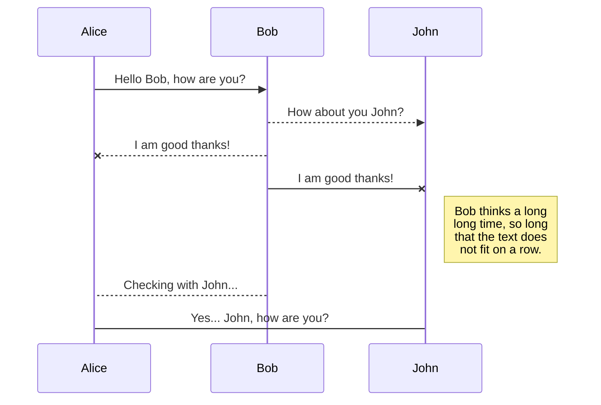
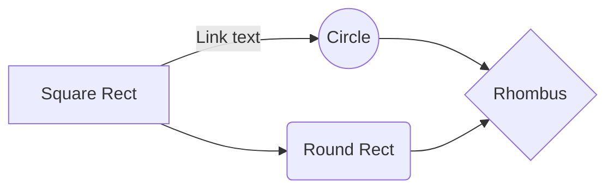

# Main Title
Gregor Kunc, Vid Jerič, David Urankar

## Opis poskusa
 
Na mizo smo položili stekleno brizko katero smo stiskali. S tem da smo odprtino brizge pritrdili na barometer s keterim smo merili tlak v brizgi. Ter na sam stisljiv del brizge smo pritiskali z silomerom in merili s kakšno silo smo delovali na brizgo. 

### Skica poskusa 

## Fizikalne količine 

### Merjene
- Sila [$N$]
- Premik [$m$]
- Sprememba volumna [$m^3$]
- Tlak [$Pa$]
### Izračunane 
- Delo [$J$]
### Odvisne 
 - Tlak [$Pa$]
### Neodvisne 
- Sila [$N$]
- Premik [$m$]
- Sprememba volumna [$m^3$]
- Tlak [$Pa$]
 
### Konstante 
- Zunanji tlak [$Pa$]

## Negotovosti in njihov vpliv 

### Merske
- Ravnilo +- 0.5mm
- Barometer +- 1kPa
- Silomer +- 1N
- Volumen +-0.5mL

### Vpliv negotovosti na poskus 

Veriacija izračunanih količin ter samo odčitavanje rezultatov.

## Predpostavke in njihov vpliv 

### Predpostavke 
- Zrak ne pušča ven iz brizge
- S silomerom smo potiskali naravnost (ne pod kotom)
- Zrak v cevi se ne segreva (Izotermna sprememba)
- Tlak, ki ga merimo je enak tlaku "bata" na zrak v brizgi
### Vpliv predpostavk na poskus 

## Meritve 

### Graf meritev 

## Opis vzorca 

## Matematični postopek 

### Napoved glede na graf $p(T)$ 

## Lajf je borba 

## SmartyPants

SmartyPants converts ASCII punctuation characters into "smart" typographic punctuation HTML entities. For example:

|                |ASCII                          |HTML                         |
|----------------|-------------------------------|-----------------------------|
|Single backticks|`'Isn't this fun?'`            |'Isn't this fun?'            |
|Quotes          |`"Isn't this fun?"`            |"Isn't this fun?"            |
|Dashes          |`-- is en-dash, --- is em-dash`|-- is en-dash, --- is em-dash|

## KaTeX

You can render LaTeX mathematical expressions using [KaTeX](https://khan.github.io/KaTeX/):

The *Gamma function* satisfying $\Gamma(n) = (n-1)!\quad\forall n\in\mathbb N$ is via the Euler integral

$$
\Gamma(z) = \int_0^\infty t^{z-1}e^{-t}dt\,.
$$

> You can find more information about **LaTeX** mathematical expressions [here](http://meta.math.stackexchange.com/questions/5020/mathjax-basic-tutorial-and-quick-reference).

## UML diagrams

You can render UML diagrams using [Mermaid](https://mermaidjs.github.io/). For example, this will produce a sequence diagram:

And this will produce a flow chart:

<!--stackedit_data:
eyJoaXN0b3J5IjpbODc1NzkyOTM0LDQ0NjYyNjY4MywxODY3Nj
MyODE4XX0=
-->